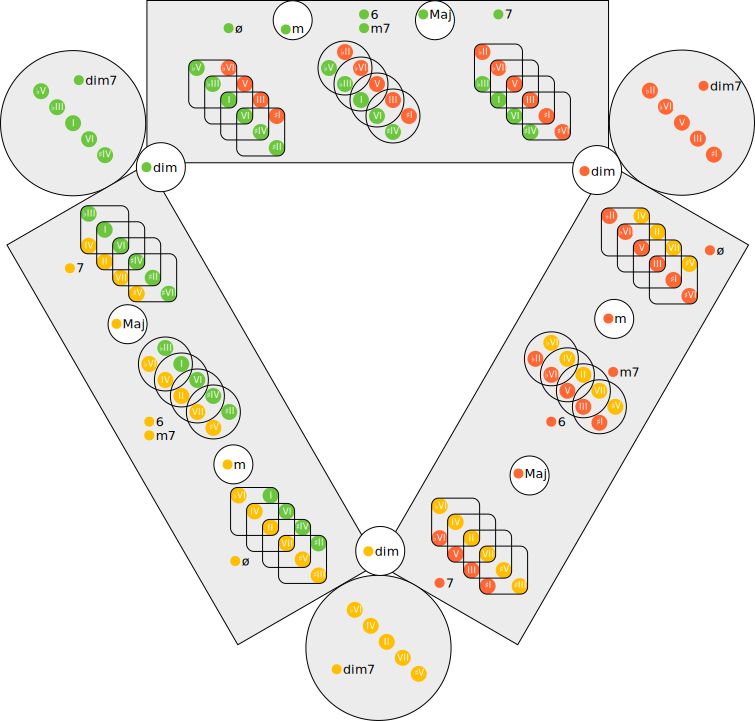

# tonnetz-dim

## PNG

## SVG

## References

- [A Unified Theory of Diminished Chords ― The Pop Descriptivist](https://m.youtube.com/watch?v=rCpJYOj_a9M)
- The color palette is taken from [ネオ・リーマン理論❶ PLR操作とトネッツ - 2ページ目 (2ページ中) - SoundQuest](https://soundquest.jp/quest/chord/chord-mv8/neo-riemannian-theory-1/2/) and [中心軸システム - SoundQuest](https://soundquest.jp/quest/chord/chord-mv8/axis-system/)